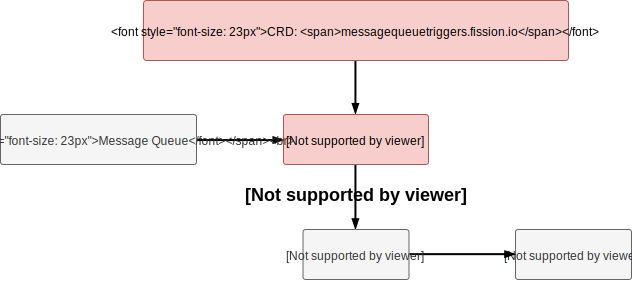

Message queuing allows users to invoke function in an asynchronous way by sending messages. Following, 
we will see how Fission supports message queuing and how your functions getting invoked. 

### Message Queuing in Fission 

Since all functions are invoked by HTTP calls, in order to support message queuing a component called `MQTrigger`, which sit 
between message queue and user function, is introduced to subscribe to different message topics and invoke function when needed.




The MQTrigger keeps watching the CRD changes of message queue trigger (messagequeuetriggers.fission.io).

```bash
$ fission mqtrigger create --name hello --function node --topic foobar
```

When a message queue trigger was created with the command above, the MQTrigger first subscribes to the topic `foobar` and waits for
messages being published to message queue. As long as MQTrigger receives a message from certain topic, it then sends a `POST` HTTP call
to function `node` with the content body of message.

We may also want to receive success/error response after each function invocation. To achieve this, you can add additional `--resptopic`
and `--errortopic` flags when creating message queue trigger.

```bash
$ fission mqtrigger create --name hello --function node --topic foobar \
    --resptopic foo --errortopic bar --maxretries 3
```

If a function returns with 200 HTTP status code, the MQTrigger will send the response body to `resptopic`; otherwise, MQTrigger 
will retry multiple times until reach `maxretries` and sends to `errortopic` if all invocations failed.   

{}
Currently, only **nats-streaming** type message queue trigger supports error topic.
{}

### Message Queue Supportability

Fission now supports following kinds of message queue:

* [NATS Streaming]({})
* Azure Queue Service
* Kafka

### How to Add New Message Queue Support

We are always looking forward to any contribution. To add new message queue, you need to implement the [MessageQueue](https://github.com/fission/fission/blob/master/pkg/mqtrigger/messageQueue/messageQueue.go#L49-L52) interface 
and see [here](https://github.com/fission/fission/tree/master/pkg/mqtrigger/messageQueue) for current existing implementations.
